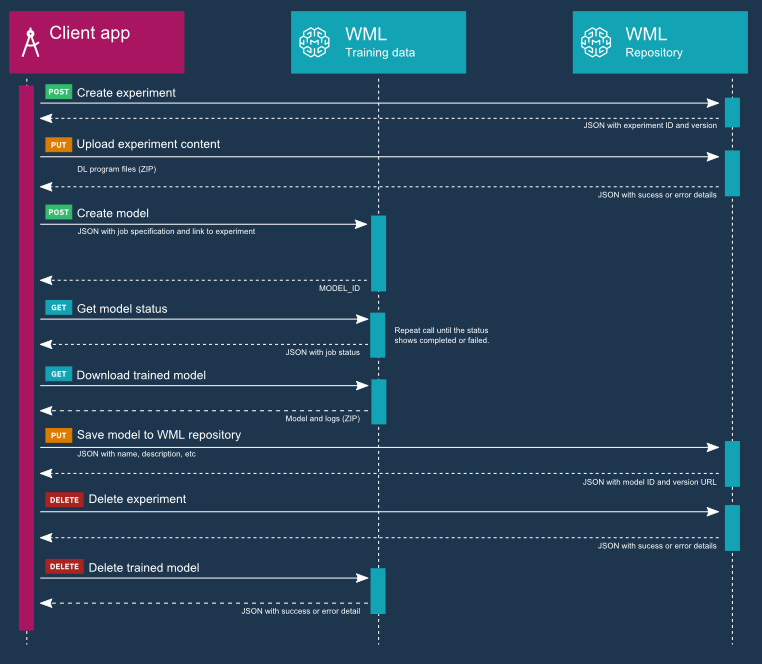

---

copyright:
  years: 2016, 2017
lastupdated: "2017-11-07"

---
{:new_window: target="_blank"}
{:shortdesc: .shortdesc}
{:screen: .screen}
{:codeblock: .codeblock}
{:pre: .pre}

# Introduction to deep learning

Use {{site.data.keyword.pm_full}} to perform deep learning experiments. You can leverage algorithms to solve complex semantic problems through the use of the deep learning framework and APIs. 
{: shortdesc}

In {{site.data.keyword.pm_full}}, you work with deep learning by calling API commands. The following process flow shows how deep learning experments work within the context of the Watson Machine Learning environment when you use the REST API:

Deep learning is supported by [frameworks](ml_dlaas_supported_framework.html).

You must set up your deep learning environment by including an [object store](ml_dlaas_object_store.html).

You can work with our [sample models](ml_dlaas_working_with_sample_models.html), or create your own [new models](ml_dlaas_working_with_new_models.html).

## Learn more

[A quick deep learning tutorial](https://www.ibm.com/blogs/watson/2016/10/quick-deep-learning-tutorial/)

